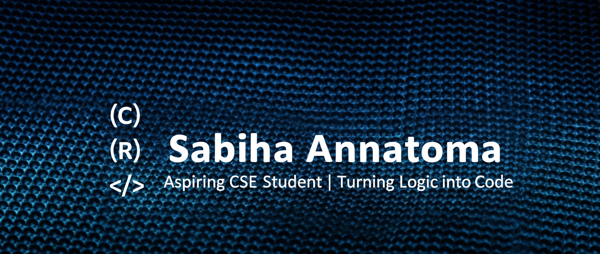

# Hi there, I'm Sabiha Tabassum Annatoma 
### Aspiring Software Engineer | Problem Solver | Tech Enthusiast
I am an aspiring Computer Science student and a self-taught programmer, currently building a strong foundation in C and Problem Solving before starting my university journey.

---

##  My Journey
-  Currently working on: **C Programming & Logical Problem Solving**
-  Learning: **Data Structures, Git/GitHub, and Clean Code Practices**
-  Goal: To become a "Diamond Student" and a top-tier Software Engineer.

## Technical Toolbox
- **Languages:** C (Intermediate), C++ (Learning)
- **Tools:** Git, GitHub, VS Code
- **Concepts:** Mathematical Logic, Robust Error Handling
  🌍 **Check out my [Live Portfolio Website](https://sabihaannatoma-lab.github.io/web-basics/)!**
### 📊 My GitHub Metrics

  

  

## 📬 Let's Connect!
- [LinkedIn](-(Coming Soon / Under Construction)
  

<!--
**sabihaannatoma-lab/sabihaannatoma-lab** is a ✨ _special_ ✨ repository because its `README.md` (this file) appears on your GitHub profile.

Here are some ideas to get you started:

- 🔭 I’m currently working on ...
- 🌱 I’m currently learning ...
- 👯 I’m looking to collaborate on ...
- 🤔 I’m looking for help with ...
- 💬 Ask me about ...
- 📫 How to reach me: ...
- 😄 Pronouns: ...
- ⚡ Fun fact: ...
-->
